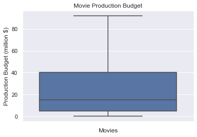
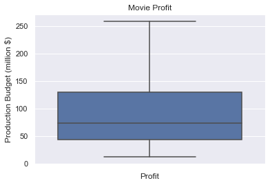
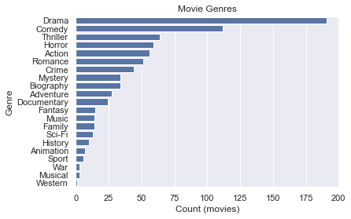
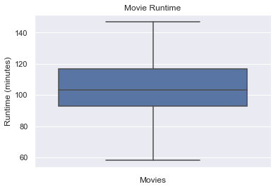
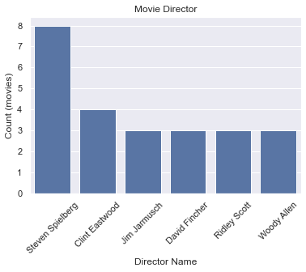
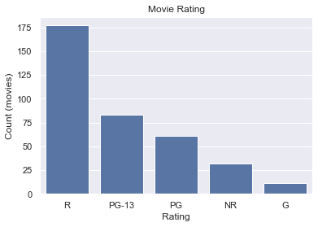

# dsc_phase1_project

This is the cumulative Phase 1 project
Author: Timothy Fuger

## Overview

The goal of this project is to utlize descriptive analysis of movie data from multiple sources in order to make a recommendation to a new movie studio company (Microsoft) on what types of movies they should pursue. The analysis will reveal that there is a typical range for spending on movies, and successful movies have a higher frequency of certain types of categories. These categories will be the recommendations to the client as what makes a movie successful.

## Business Problem

The primary ask from the movie company is that the type of movies they pursue are similar to the ones "doing best at the box office." From a business perspective, I believe that they are looking to receive the greatest return on the investment that is placed in the first movie they produce. So we will want to provide a proposed path for how much to spend on a movie and what types of movies provide the highest rate of return.

## Data

The following data has been pulled from five different sources: IMDB, Rotten Tomatoes, Box Office Mojo, The Movie DB, and The Numbers. All of these sources hold a variety of information associated with past movies that were the guide for this analysis. These included financial information such as budget, and gross, as well as other categorical data such as genre, rating, viewer reviews, runtime, directors, and others categories of information.

## Methods

This project uses descriptive analysis, including description of trends within a given dataset of movies. This will allow us to pinpoint sucessful movies from the past, and use them as our point of focus for determining what categorical data is similar between them.

## Results

Our results have revealed a few findings on what movie Microsoft should pursue through their new movie studio. Here are the takeaways in analyzing movies that have at least 200% ROI:
- The average cost of production for a movie with the range being the 25% to 75% quartile range, has been shown to be within 5 million to 40 million dollars.

- The profit for a movie with the range being the 25% to 75% quartile range, can be 12 million to 260 million dollars.

Analyzing movies that have at least 200% ROI and a range of production cost being from 5 million to 40 million:
- The genre ordered by highest frequency in the dataset are Drama, Comedy, and Thriller

- The runtime for a movie with the range being the 25% to 75% quartile range, can be from 93 minutes to 116.5 minutes long

Analyzing viewer reviews that are over 7 out of 10:
- The directors listed by highest frequency in the dataset are Steven Spielberg, Clint Eastwood, Ridley Scott, Jim Jamusch, and David Fincher (these exclude Woody Allen who is no longer active as a director).

- The rating listed by highest frequency in the dataset are R, PG-13, and PG.

## Conclusions

Our recommendation to Microsoft would be to follow the average production budget ranges (5 million to 40 million) to start off with their first movie. They should also produce movies that are within the most frequent within the high ROI dataset that we analyzed. The categories as determined from those results would be pursuing dramas, that run for about an hour and a half. Other recommendations as taken from the highest viewer rated movies, would be to produce an R rated movie, and have Steven Spielberg as the director. 

## Next Steps

If given more time the following could be pursued:

- Perform analysis on the soft recommendation categories to correlate to the budget and profit of movies

- Look at other categories that would be relevant to pursue to understand movie success such as movie studio, domestic vs foreign gross, and movie writer

- Integrate marketing spending vs profit

## For More Information

See the full analysis in the [Jupyter Notebook](Notebook.ipynb) or review this [presentation](Flatiron_Phase1_Project_Presentation.pdf).

For additional info, contact Tim Fuger at tfuger10@gmail.com

## Repository Navigation

In this repository you will find 4 files to take note of:
1. [Jupyter Notebook](Notebook.ipynb) which contains all of the code for this project

2. [zippedData](zippedData) which contains all of the data from each of the 5 movie website sources that the data has been mined from

3. The [Microsoft Movie Studio Presentation](Microsoft Movie Studio Presentation.pptx) powerpoint file

4. The [Microsoft Movie Studio Presentation](Microsoft Movie Studio Presentation.pdf) PDF file

5. [images](images) folder which contains all the images that are used in the markdown file
